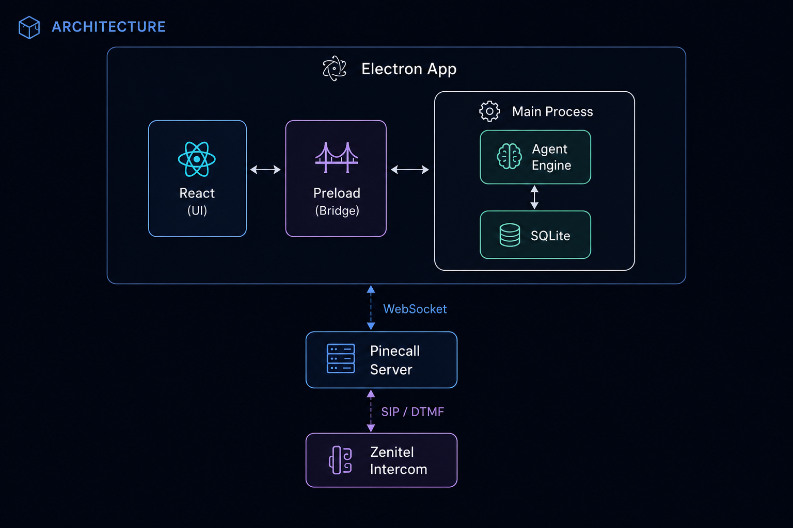
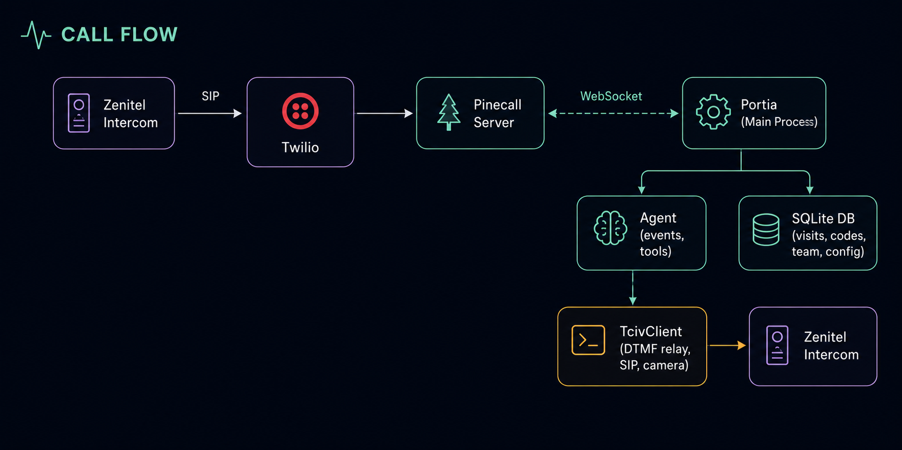

# Portia

AI-powered voice receptionist for Zenitel intercoms. Built with [Pinecall](https://pinecall.io), Electron, and React.

Portia turns any Zenitel intercom into an intelligent building access system — visitors press the call button, speak with an AI agent, and get verified through access codes, visitor history, or team member contact.

## Features

- **Voice AI Agent** — Real-time voice conversations powered by GPT-4.1 with configurable LLM, STT, and TTS providers
- **Access Code Verification** — 5-digit codes validated against the database with automatic door relay control
- **Visitor Management** — Full CRUD for visitors, team members, access codes, and escalations
- **Live Dashboard** — Real-time call transcript, protocol stepper, visitor badge, and camera feed
- **Zenitel Integration** — Auto-provisioning, SIP configuration, DTMF relay control, and MJPEG camera
- **Setup Wizard** — Zero-config device discovery, connection testing, and one-click provisioning
- **Agent Configuration** — Hot-swappable voice, model, STT/TTS provider, language, and prompt template

## Architecture

<p align="center">
  
</p>

### Call Flow

<p align="center">
  
</p>

## Prerequisites

- [Node.js](https://nodejs.org/) 20+
- A [Pinecall](https://pinecall.io) API key
- A [Twilio](https://twilio.com) account with Elastic SIP Trunking
- A Zenitel intercom on your local network (optional — the app works in demo mode)

## Quick Start

```bash
# Clone
git clone https://github.com/pinecall/portia.git
cd portia

# Install
npm install

# Configure
cp .env.example .env
# Edit .env with your API keys (see Environment Variables below)

# Run in development
npm run dev
```

## Environment Variables

Copy `.env.example` to `.env` and configure:

| Variable | Required | Description |
|----------|----------|-------------|
| `PORTIA_API_KEY` | Yes | Pinecall API key from [pinecall.io](https://pinecall.io) |
| `PORTIA_SIP_DOMAIN` | Yes | Twilio SIP domain (e.g. `your-domain.sip.twilio.com`) |
| `PORTIA_SIP_AUTH_USER` | Yes | SIP authentication username |
| `PORTIA_SIP_AUTH_PASS` | Yes | SIP authentication password |
| `PORTIA_VOICE_ID` | No | Voice ID in format `provider:id` (e.g. `elevenlabs:abc123`) |
| `PORTIA_LLM_MODEL` | No | LLM model (default: `gpt-4.1-mini`) |
| `PORTIA_ZENITEL_USER` | No | Zenitel device username (default: `admin`) |
| `PORTIA_ZENITEL_PASS` | No | Zenitel device password |
| `PORTIA_RELAY_TIMER_MS` | No | Door open duration in ms (default: `7000`) |
| `PORTIA_LOG_LEVEL` | No | Log level: `debug`, `info`, `warn`, `error` (default: `info`) |
| `PORTIA_TEST_PHONE` | No | Optional phone number for testing |

> **Important:** Never commit your `.env` file. It's in `.gitignore` by default.

## Scripts

| Command | Description |
|---------|-------------|
| `npm run dev` | Start in development mode with hot reload |
| `npm run build` | Build for production |
| `npm run build:mac` | Build + package for macOS |
| `npm run build:win` | Build + package for Windows |
| `npm test` | Run test suite (vitest) |
| `npm run test:watch` | Run tests in watch mode |
| `npm run typecheck` | TypeScript type checking |

## Project Structure

```
portia/
├── src/
│   ├── main/                  # Electron main process
│   │   ├── agent/             # Voice agent orchestration
│   │   │   ├── events/        # Agent → UI event wiring
│   │   │   ├── prompt/        # Prompt templates & builder
│   │   │   ├── services/      # Business logic (visit recording)
│   │   │   └── tools/         # Tool definitions (zod schema + handler)
│   │   │       ├── define-tool.ts    # defineTool() factory
│   │   │       ├── registry.ts       # Tool registry + schema generation
│   │   │       └── handlers/         # Individual tool implementations
│   │   ├── config/            # Environment variables
│   │   ├── db/                # SQLite connection, migrations, repos
│   │   │   └── repos/         # Data access layer (CRUD per entity)
│   │   ├── ipc/               # IPC channel handlers
│   │   └── types/             # Module augmentations
│   ├── ui/                    # React renderer (aliased as @ui/)
│   │   └── src/
│   │       ├── pages/         # Page components
│   │       ├── hooks/         # Custom React hooks
│   │       └── stores/        # Zustand state stores
│   ├── shared/                # Types shared between main & renderer
│   └── preload/               # Electron preload bridge
├── .env.example               # Environment variable template
├── electron.vite.config.ts    # Build configuration
├── vitest.config.ts           # Test configuration
└── package.json
```

## Tool System

Tools use `defineTool()` which co-locates the **zod schema** (runtime validation), **handler** (business logic), and **OpenAI schema** (auto-generated) in a single module:

```typescript
import { z } from 'zod'
import { defineTool } from '../define-tool'

export const openDoor = defineTool({
  name: 'openDoor',
  description: 'Verify access code and open the building door',
  schema: z.object({
    code: z.string().describe('5-digit numeric access code'),
  }),
  async handler(params, call, { db, zenitel }) {
    const result = db.validateCode(params.code)
    if (!result.valid) return { success: false, error: 'Invalid code' }
    await zenitel.activateRelay({ relayId: 'relay1', timer: 7 })
    return { success: true, visitor: result.visitor }
  },
})
```

### Available Tools

| Tool | Description | Required Args |
|------|-------------|---------------|
| `identifyVisitor` | Update visitor credential card | — (all optional) |
| `openDoor` | Validate code & open door relay | `code` |
| `lookupVisitor` | Search visit history | — (name or company) |
| `escalateToSecurity` | Register security incident | `reason`, `urgency` |
| `contactTeamMember` | Notify team member of visitor | `teamMemberId`, `visitorName` |

## Database

SQLite with `sql.js` (WASM). Data stored in `~/Library/Application Support/portia/portia.db` (macOS) or equivalent.

### Tables

| Table | Description |
|-------|-------------|
| `config` | Key-value store for app configuration |
| `team` | Team member directory |
| `access_codes` | Visitor access codes with expiry |
| `visits` | Visit history with outcomes |
| `events` | System event log |
| `escalations` | Security escalation records |

### Typed Queries

All repos use generic `queryAll<T>()` / `queryOne<T>()` — no unsafe casts:

```typescript
// Returns TeamMember[] — fully typed
export function getTeam(): TeamMember[] {
  return queryAll<TeamMember>('SELECT * FROM team')
}
```

## Testing

```bash
# Run all tests
npm test

# Watch mode
npm run test:watch
```

Tests use `vitest` with an in-memory SQLite database:

| Test Suite | Tests | What |
|-----------|-------|------|
| `codes.repo.test.ts` | 5 | Code validation, expiry, soft delete |
| `team.repo.test.ts` | 7 | CRUD, fuzzy search, status defaults |
| `migrations.test.ts` | 3 | Table creation, versioning, idempotency |
| `keyterms.test.ts` | 4 | Name extraction, filtering, STT boost |
| `registry.test.ts` | 4 | OpenAI schema generation, required params |
| `open-door.test.ts` | 6 | Code validation, relay mock, event logging |
| `visit-recorder.test.ts` | 6 | Outcome parsing, transcript summary |

## Agent Configuration

The agent can be configured through the Settings → Agent tab:

- **LLM Model**: GPT-4.1 Mini/Nano, GPT-4o, Mistral Small/Medium/Large
- **STT Provider**: Deepgram Flux, Deepgram Nova-3, Gladia Solaria, AWS Transcribe
- **TTS Provider**: ElevenLabs, Cartesia Sonic-3, OpenAI, AWS Polly
- **Turn Detection**: Native, SmartTurn, Silence
- **Language**: English, Spanish, French, German, Portuguese, Italian, Arabic, Dutch, Polish, Turkish
- **Prompt Template**: OpenAI-optimized or Mistral-optimized (or custom)

All settings are hot-swappable — changes apply to the live agent session without restart.

## Building for Production

```bash
# macOS
npm run build:mac

# Windows
npm run build:win
```

Packages are output to `release/`.

## License

MIT

## Credits

Built with [Pinecall](https://pinecall.io) — the voice AI platform for building real-time voice agents.
