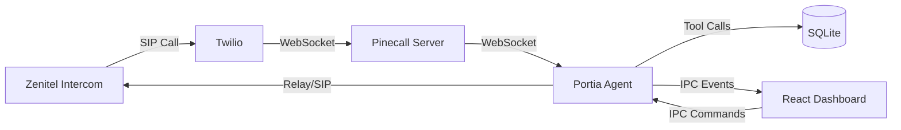
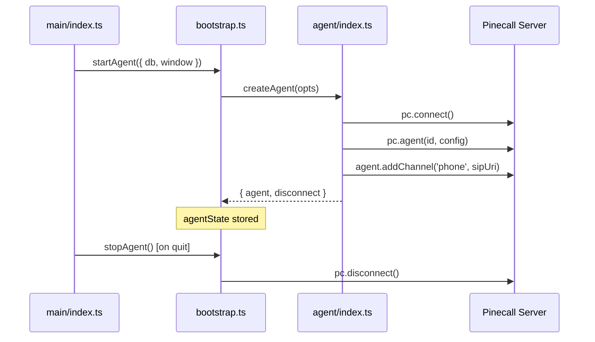

# Portia Architecture

Electron desktop app that turns Zenitel intercoms into AI-powered voice receptionists.

## Data Flow



## Directory Map

| Directory | Responsibility | Suffix Convention |
|-----------|---------------|-------------------|
| `main/agent/` | Agent orchestration, prompt, keyterms | — |
| `main/agent/tools/` | Tool definitions (schema + handler) | `<name>.ts` |
| `main/agent/services/` | Business logic (visit recording) | `*.service.ts` |
| `main/agent/events/` | Event wiring (agent → renderer) | — |
| `main/agent/prompt/` | Prompt templates and builder | — |
| `main/db/` | SQLite connection, migrations | — |
| `main/db/repos/` | Data access (CRUD per entity) | `*.repo.ts` |
| `main/ipc/` | IPC channel handlers | `*.ipc.ts` |
| `main/config/` | Environment variables | — |
| `main/types/` | Module augmentations, shared types | `*.d.ts` |
| `renderer/src/` | React UI (aliased as `@ui/`) | — |
| `renderer/src/pages/` | Page components (CRUD, dashboard) | `*Page.tsx` |
| `renderer/src/hooks/` | Custom React hooks | `use*.ts` |
| `shared/` | Types shared between main & renderer | — |

## Tool System

Tools use `defineTool()` which co-locates:
- **Zod schema** — validated at runtime before handler
- **Handler** — typed args inferred from schema
- **OpenAI schema** — auto-generated from zod

```
agent/tools/
├── define-tool.ts          ← Factory
├── types.ts                ← ToolContext, ToolHandler
├── registry.ts             ← TOOLS array, executeTool(), toolSchemas()
└── handlers/
    ├── identify-visitor.ts ← defineTool({ schema, handler })
    ├── open-door.ts
    ├── lookup-visitor.ts
    ├── escalate-to-security.ts
    └── contact-team-member.ts
```

## DB Layer

```
db/
├── connection.ts   ← queryAll<T>, queryOne<T>, run, exec
├── migrations.ts   ← Schema versioning
├── index.ts        ← PortiaDB facade class
├── seed.ts         ← Demo data (Cointel)
└── repos/
    ├── codes.repo.ts
    ├── team.repo.ts
    ├── visits.repo.ts
    ├── events.repo.ts
    ├── escalations.repo.ts
    ├── stats.repo.ts
    └── config.repo.ts
```

All repos use generic `queryAll<T>()` — no `as any` or `as unknown as` casts.

## Agent Lifecycle


